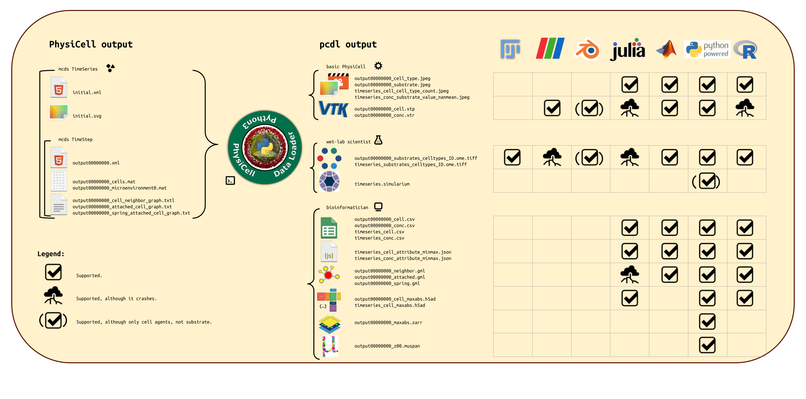

## Abstract:

physicell data loader (pcdl) provides a platform-independent (Windows, MacOSX, Linux), python3 based, [pip](https://en.wikipedia.org/wiki/Pip_(package_manager))-installable set of commands,
to load output, generated with the [PhysiCell](https://github.com/MathCancer/PhysiCell) agent-based modeling and diffusion solver framework,
into [python3](https://en.wikipedia.org/wiki/Python_(programming_language)) or transform PhysiCell output into more widely used data formats,
straight on the command line.



<!--
pcdl was forked from the original [PhysiCell-Tools](https://github.com/PhysiCell-Tools) [python-loader](https://github.com/PhysiCell-Tools/python-loader) implementation.

The pcdl python3 library maintains four branches:

+ **Branch version 1** is the original PhysiCell-Tools/python-loader code.
+ **Branch version 2** will be strictly compatible with the original PhysiCell-Tools/python-loader code, although pip installable.
+ **Branch version 3** might break with old habits, although tries to be as much downward compatible as possible.
  The aim of the v3 branch was to get a very lean and agile python3 physicell output interface for the ones coming from the python3 world.
+ Finally, **Branch version 4** reimplemented the backend in a more python3, less C++ like manner.
-->

## Software Specification:

+ Language: python [>= 3.11](https://devguide.python.org/versions/)
+ Library core dependencies: matplotlib, numpy, pandas, scipy
+ Library optional dependencies: anndata, bioio, geopandas, networkx, neuroglancer, requests, scikit-image, shapely, simulariumio, spatialdata, vtk
+ Date of origin original PhysiCell-Tools python-loader: 2019-09-02
+ Date of origin pcdl fork: 2022-08-30
+ Doi: https://doi.org/10.5281/ZENODO.8176399
+ License: [BSD-3-Clause](https://en.wikipedia.org/wiki/BSD_licenses)
+ User manual: this README.md file
+ Source code: [https://github.com/elmbeech/physicelldataloader](https://github.com/elmbeech/physicelldataloader)


## &#x2728; HowTo Guide:

+ [installation and troubleshooting](https://github.com/elmbeech/physicelldataloader/tree/master/man/HOWTO.md)


## &#x2728; Tutorial:

Basics Tutorials:

1. [pcdl background](https://github.com/elmbeech/physicelldataloader/tree/master/man/TUTORIAL_introduction.md)
1. [pcdl processing mcds time steps in python3](https://github.com/elmbeech/physicelldataloader/tree/master/man/TUTORIAL_python3_timestep.md)
1. [pcdl processing mcds time series in python3](https://github.com/elmbeech/physicelldataloader/tree/master/man/TUTORIAL_python3_timeseries.md)
1. [pcdl from the command line](https://github.com/elmbeech/physicelldataloader/tree/master/man/TUTORIAL_commandline.md)

Extras tutorials python3 language:

+ [pcdl and python3 and graphs](https://github.com/elmbeech/physicelldataloader/tree/master/man/TUTORIAL_python3_graph.md)
+ [pcdl and python3 and json](https://github.com/elmbeech/physicelldataloader/blob/master/man/TUTORIAL_python3_json.md)
+ [pcdl and python3 and matplotlib](https://github.com/elmbeech/physicelldataloader/tree/master/man/TUTORIAL_python3_matplotlib.md)
+ [pcdl and python3 and muspan](https://github.com/elmbeech/physicelldataloader/tree/master/man/TUTORIAL_python3_muspan.md)
+ [pcdl and python3 and napari](https://github.com/elmbeech/physicelldataloader/tree/master/man/TUTORIAL_python3_napari.md)
+ [pcdl and python3 and ome.tiff, tiff, png, and jpeg](https://github.com/elmbeech/physicelldataloader/tree/master/man/TUTORIAL_python3_ometiff.md)
+ [pcdl and python3 and pandas](https://github.com/elmbeech/physicelldataloader/tree/master/man/TUTORIAL_python3_pandas.md)
+ [pcdl and python3 and scanpy and squidpy](https://github.com/elmbeech/physicelldataloader/tree/master/man/TUTORIAL_python3_scverse.md)
+ [pcdl and python3 and vtk](https://github.com/elmbeech/physicelldataloader/tree/master/man/TUTORIAL_python3_vtk.md)

Extras tutorials for other languages than python3:

+ [pcdl and julia](https://github.com/elmbeech/physicelldataloader/tree/master/man/TUTORIAL_julia.md)
+ [pcdl and matlab](https://github.com/elmbeech/physicelldataloader/tree/master/man/TUTORIAL_matlab_octave.md)
+ [pcdl and R](https://github.com/elmbeech/physicelldataloader/tree/master/man/TUTORIAL_r.md)

Extras tutorials for GUI software:

+ [pcdl and paraview](https://github.com/elmbeech/physicelldataloader/tree/master/man/TUTORIAL_paraview.md)

+ [pcdl and blender](https://github.com/elmbeech/physicelldataloader/tree/master/man/TUTORIAL_blender.md)
+ [pcdl and fiji imagej, icy, qupath](https://github.com/elmbeech/physicelldataloader/tree/master/man/TUTORIAL_fijiimagej.md)
+ [pcdl and galaxy](https://github.com/elmbeech/physicelldataloader/tree/master/man/TUTORIAL_galaxy.md)
+ [pcdl and napari](https://github.com/elmbeech/physicelldataloader/tree/master/man/TUTORIAL_python3_napari.md)
+ [pcdl and neuroglancer](https://github.com/elmbeech/physicelldataloader/tree/master/man/TUTORIAL_neuroglancer.md)
+ [pcdl and simularium](https://github.com/elmbeech/physicelldataloader/tree/master/man/TUTORIAL_simularium.md)


## &#x2728; Reference Manual:

+ [API application interface](https://github.com/elmbeech/physicelldataloader/tree/master/man/REFERENCE.md)


## Discussion:

+ [presentations given](https://github.com/elmbeech/physicelldataloader/tree/master/man/lecture)

<!--
## About Documentation:

Within the pcdl library, we tried to stick to the documentation policy laid out by Daniele Procida in his "[what nobody tells you about documentation](https://www.youtube.com/watch?v=azf6yzuJt54)" talk at PyCon 2017 in Portland, Oregon.
-->


## Cite:

```bibtex
@Misc{bucher2023,
  author    = {Bucher, Elmar and Wall, Patrick and Rocha, Heber and Kurtoglu, Furkan and Eng, Jennifer and Sundus, Aneequa, and Metzcar, John and Arroya, Raquel and Heiland, Randy and Macklin, Paul},
  title     = {elmbeech/physicelldataloader: pcdl platform-independent, pip-installable interface to load PhysiCell agent-based modeling framework output into python3.},
  year      = {2023},
  copyright = {Open Access},
  doi       = {10.5281/ZENODO.8176399},
  publisher = {Zenodo},
}
```


## Contributions:

+ original PhysiCell-Tools python-loader implementation: Patrick Wall, Randy Heiland, Paul Macklin
+ fork pcdl implementation: Elmar Bucher
+ fork pcdl co-programmer: Furkan Kurtoglu, Heber Rocha, Jennifer Eng
+ fork pcdl continuous testing and feedbacks: Aneequa Sundus (python), John Metzcar (python), Raquel Arroya (matlab)
+ student prj on pcdl:
  Benjamin Jacobs (make\_graph\_gml),
  Jason Lu (render\_neuroglancer),
  Katie Pletz (beta testing),
  Leena Sohail (beta testing),
  Marshal Gress (plot\_scatter),
  Nick Oldfather (unit test model),
  Thierry-Pascal Fleurant (plot\_timeseries),
  Viviana Kwong (render\_neuroglancer)


## Develoment:

+ [Road Map and Release Notes](https://github.com/elmbeech/physicelldataloader/tree/master/man/RELEASENOTES.md)

Developers, please make pull requests to the https://github.com/elmbeech/physicelldataloader/tree/development branch. Thanks!
