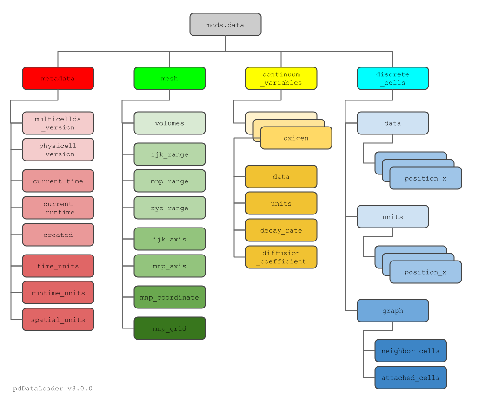

# pcDataLoader Tutorial Man Page

Please install the latest version of pcDataLoader, as descripend in the [HowTo](https://github.com/elmbeech/pcDataLoader/blob/v3/man/HOWTO.md) section.\
If you are new to pcDataLoader, install from branch v3.\
Branch v2 exist mainly for backwards compatibility.


## Tutorial - branch v2
The original python-loader tutorial can be found here.
+ http://www.mathcancer.org/blog/python-loader/


## Tutorial - branch v3

### Introduction: Anatomy of a PhysiCell MultiCellDigital Snapshot

Each time PhysiCell’s internal time tracker passes a time step where data is to be saved, it generates a number of files of various types.\
Each of these files will have a number at the end that indicates where it belongs in the sequence of outputs.\
All of the files from the first round of output will end in 00000000.* and the second round will be 00000001.* and so on.\
Have a look at this [PhysiCell data time series](https://github.com/elmbeech/pcDataLoader/tree/v3/pcDataLoader/data_timeseries_2d).

Let’s say we captured data every simmulation time hour, and we’re interested in the set of output, half a day through the run, the 13th set of output files.\
The files we care about most from this set consists of:

+ **output00000012.xml**: This file is the main organizer of the data.
    It contains an overview of the data stored in the MultiCellDS as well as some actual data including:\
    metadata (MultiCellDS version, PhysiCell or BioFVM version, simulation time, runtime, and processing time stamp),\
    coordinates for the computational domain (mesh),\
    parameters for diffusing substrates in the microenvironment (variables),\
    column labels and units for the cell data (cell_population),\
    file names for the files that contain microenvironment and cell data at this time step (mat and possibly graph.txt files),
+ **output00000012_cells.mat**: This is a MATLAB matrix file that contains all of the tracked information about the individual cells in the model.
    It tells us things like the cells’ position, volume, secretion, cell cycle status, and user-defined cell parameters.
+ **output00000012_microenvironment0.mat**: This is a MATLAB matrix file that contains all of the data about the microenvironment at this time step.


### Load the Data form a PhysiCell MultiCellDigital Snapshot into Python3
In this paragraph we will load the pcDataLoder library and data snapshot 00000012, described above, from [data_timeseries_2d](https://github.com/elmbeech/pcDataLoader/tree/v3/pcDataLoader/data_timeseries_2d) from the test dataset.
(There is no need to extra install the test data set.
In fact, both test datasets are already installed.
They ship with the pip3 pcDataLoader installation.)

```python
import pathlib  # library to locate the test data
import pcDataLoader as pc  # the PhysiCell data loader library

s_path = str(pathlib.Path(pc.__file__).parent.joinpath('data_timeseries_2d'))  # local path to the installed test data set
s_file = 'output00000012.xml'  # the snapshot we want to analyse
s_pathfile = f'{s_path}/{s_file}'
print('mcds snapshot xml:', s_pathfile)

# load mcds - multi cell digital snapshot - object
mcds = pc.pyMCDS(s_pathfile)  # loads whole snapshot: the xml and all realated mat and graph files.
```

Side notes: in general, unix and windows path notation will work.\
Additionaly, legacy way of data loaing works too.
```python
# legacy way of loading an mcds object
mcds = pc.pyMCDS('output00000012.xml', s_path)
```

By default all data realted to the snapshot is loaded.\
For speed and less memory usage, it is however possible to only load the essential (xml and cell mat data), and exclude microenviroment and graph data loading.
```python
# fine tuned way of loading an mcds object
mcds = pc.pyMCDS(s_pathfile, graph=False, microenv=False)
```

### Accessing the Loaded Data

All loaded  data lievs in `mcds.data` dictionary.\
As in **version 1**, we’ve tried to keep everything organized inside of this dictionary.\
Regarding **version 1**, the structure has slightly change.\
However, in **version 3**, all data is accessible by functions, thus there should be no need to fetch data directely form the `mcds.data` dictionary!\
Anyhow, let’s take a look at what we actually have in here.



```python
# main data branches
sorted(mcds.data.keys())  # metadata, mesh, substrate (continuum_variables), and agent (discrete_cells).

# metadata
sorted(mcds.data['metadata'].keys())  # multicellds version, physicell version, simulation time, runtime, time stamp, time unit, and spatial unit.

# mesh
sorted(mcds.data['mesh'].keys())  # voxel (ijk), mesh (nmp), and position (xyz) range, axis, coordinate, grid objects, and voxel volume.

# microenvironment
sorted(mcds.data['continuum_variables'].keys())  # list of all processed substrat, e.g. oxygen.
sorted(mcds.data['continuum_variables']['oxygen'].keys())  # substrat related data values, unit, diffusion coefficient, and decay rate.

# cell
sorted(mcds.data['discrete_cells'].keys())  # data, units, and graph dictionaries.
sorted(mcds.data['discrete_cells']['data'].keys()  # all cell realted, tracked data.
sorted(mcds.data['discrete_cells']['unit'].keys()  # all units from the cell realted, tracked data.
sorted(mcds.data['discrete_cells']['graph'].keys())  # neighbor_cells and attached_cells graph dictionaries.
```


Now, less access this data by the objects function.
#### Metadata
Let's start with **Metadata**
```python

```

#### Mesh data
Let's have a look at **Meshdata**

#### Microenvironment data
Let's have a look at the substrate.

#### Cell data


################
## HERE I AM ##
###############


The data member dictionary is a dictionary of dictionaries whose child dictionaries can be accessed through normal python dictionary syntax.
?

mcds.data['metadata']
mcds.data['continuum_variables']['my_chemical']

Each of these subdictionaries contains data, we will take a look at exactly what that data is and how it can be accessed in the following sections.
Metadata


Expanded metadata subdictionary

The metadata dictionary contains information about the time of the simulation as well as units for both times and space. Here and in later sections blue boxes indicate scalars and green boxes indicate strings. We can access each of these things using normal dictionary syntax. We’ve also got access to a helper function get_time() for the common operation of retrieving the simulation time.
?

>>> mcds.data['metadata']['time_units']
'min'
>>> mcds.get_time()
5220.0
Mesh

Expanded mesh dictionary

The mesh dictionary has a lot more going on than the metadata dictionary. It contains three numpy arrays, indicated by orange boxes, as well as another dictionary. The three arrays contain x, y and z coordinates for the centers of the voxels that constiture the computational domain in a meshgrid format. This means that each of those arrays is tensors of rank three. Together they identify the coordinates of each possible point in the space.

In contrast, the arrays in the voxel dictionary are stored linearly. If we know that we care about voxel number 42, we want to use the stuff in the voxels dictionary. If we want to make a contour plot, we want to use the x_coordinates, y_coordinates, and z_coordinates arrays.
?

# We can extract one of the meshgrid arrays as a numpy array
>>> y_coords = mcds.data['mesh']['y_coordinates']
>>> y_coords.shape
(75, 75, 75)
>>> y_coords[0, 0, :4]
array([-740., -740., -740., -740.])

# We can also extract the array of voxel centers
>>> centers = mcds.data['mesh']['voxels']['centers']
>>> centers.shape
(3, 421875)
>>> centers[:, :4]
array([[-740., -720., -700., -680.],
       [-740., -740., -740., -740.],
       [-740., -740., -740., -740.]])

# We have a handy function to quickly extract the components of the full meshgrid
>>> xx, yy, zz = mcds.get_mesh()
>>> yy.shape
(75, 75, 75)
>>> yy[0, 0, :4]
array([-740., -740., -740., -740.])

# We can also use this to return the meshgrid describing an x, y plane
>>> xx, yy = mcds.get_2D_mesh()
>>> yy.shape
(75, 75)


Continuum variables

Expanded microenvironment dictionaries

The continuum_variables dictionary is the most complicated of the four. It contains subdictionaries that we access using the names of each of the chemicals in the microenvironment. In our toy example above, these are oxygen and my_chemical. If our model tracked diffusing oxygen, VEGF, and glucose, then the continuum_variables dictionary would contain a subdirectory for each of them.

For a particular chemical species in the microenvironment we have two more dictionaries called decay_rate and diffusion_coefficient, and a numpy array called data. The diffusion and decay dictionaries each complete the value stored as a scalar and the unit stored as a string. The numpy array contains the concentrations of the chemical in each voxel at this time and is the same shape as the meshgrids of the computational domain stored in the .data[‘mesh’] arrays.
?

# we need to know the names of the substrates to work with
# this data. We have a function to help us find them.
>>> mcds.get_substrate_names()
['oxygen', 'my_chemical']

# The diffusable chemical dictionaries are messy
# if we need to do a lot with them it might be easier
# to put them into their own instance
>>> oxy_dict = mcds.data['continuum_variables']['oxygen']
>>> oxy_dict['decay_rate']
{'value': 0.1, 'units': '1/min'}

# What we care about most is probably the numpy
# array of concentrations
>>> oxy_conc = oxy_dict['data']
>>> oxy_conc.shape
(75, 75, 75)

# Alternatively, we can get the same array with a function
>>> oxy_conc2 = mcds.get_concentrations('oxygen')
>>> oxy_conc2.shape
(75, 75, 75)

# We can also get the concentrations on a plane using the
# same function and supplying a z value to "slice through"
# note that right now the z_value must be an exact match
# for a plane of voxel centers, in the future we may add
# interpolation.
>>> oxy_plane = mcds.get_concentrations('oxygen', z_value=100.0)
>>> oxy_plane.shape
(75, 75)

# we can also find the concentration in a single voxel using the
# position of a point within that voxel. This will give us an
# array of all concentrations at that point.
>>> mcds.get_concentrations_at(x=0., y=550., z=0.)
array([17.94514446,  0.99113448])


Discrete Cells

expanded cells dictionary

The discrete cells dictionary is relatively straightforward. It contains a number of numpy arrays that contain information regarding individual cells.  These are all 1-dimensional arrays and each corresponds to one of the variables specified in the output*.xml file. With the default settings, these are:

    ID: unique integer that will identify the cell throughout its lifetime in the simulation
    position(_x, _y, _z): floating point positions for the cell in x, y, and z directions
    total_volume: total volume of the cell
    cell_type: integer label for the cell as used in PhysiCell
    cycle_model: integer label for the cell cycle model as used in PhysiCell
    current_phase: integer specification for which phase of the cycle model the cell is currently in
    elapsed_time_in_phase: time that cell has been in current phase of cell cycle model
    nuclear_volume: volume of cell nucleus
    cytoplasmic_volume: volume of cell cytoplasm
    fluid_fraction: proportion of the volume due to fliud
    calcified_fraction: proportion of volume consisting of calcified material
    orientation(_x, _y, _z): direction in which cell is pointing
    polarity:
    migration_speed: current speed of cell
    motility_vector(_x, _y, _z): current direction of movement of cell
    migration_bias: coefficient for stochastic movement (higher is “more deterministic”)
    motility_bias_direction(_x, _y, _z): direction of movement bias
    persistence_time: time in-between direction changes for cell
    motility_reserved:

?

# Extracting single variables is just like before
>>> cell_ids = mcds.data['discrete_cells']['ID']
>>> cell_ids.shape
(18595,)
>>> cell_ids[:4]
array([0., 1., 2., 3.])

# If we're clever we can extract 2D arrays
>>> cell_vec = np.zeros((cell_ids.shape[0], 3))
>>> vec_list = ['position_x', 'position_y', 'position_z']
>>> for i, lab in enumerate(vec_list):
...     cell_vec[:, i] = mcds.data['discrete_cells'][lab]
...
array([[ -69.72657128,  -39.02046405, -233.63178904],
       [ -69.84507464,  -22.71693265, -233.59277388],
       [ -69.84891462,   -6.04070516, -233.61816711],
       [ -69.845265  ,   10.80035554, -233.61667313]])

# We can get the list of all of the variables stored in this dictionary
>>> mcds.get_cell_variables()
['ID',
 'position_x',
 'position_y',
 'position_z',
 'total_volume',
 'cell_type',
 'cycle_model',
 'current_phase',
 'elapsed_time_in_phase',
 'nuclear_volume',
 'cytoplasmic_volume',
 'fluid_fraction',
 'calcified_fraction',
 'orientation_x',
 'orientation_y',
 'orientation_z',
 'polarity',
 'migration_speed',
 'motility_vector_x',
 'motility_vector_y',
 'motility_vector_z',
 'migration_bias',
 'motility_bias_direction_x',
 'motility_bias_direction_y',
 'motility_bias_direction_z',
 'persistence_time',
 'motility_reserved',
 'oncoprotein',
 'elastic_coefficient',
 'kill_rate',
 'attachment_lifetime',
 'attachment_rate']
# We can also get all of the cell data as a pandas DataFrame
>>> cell_df = mcds.get_cell_df()
>>> cell_df.head()
ID     position_x   position_y    position_z total_volume cell_type cycle_model ...
0.0   - 69.726571  - 39.020464  - 233.631789       2494.0       0.0         5.0 ...
1.0   - 69.845075  - 22.716933  - 233.592774       2494.0       0.0         5.0 ...
2.0   - 69.848915  - 6.040705   - 233.618167       2494.0       0.0         5.0 ...
3.0   - 69.845265    10.800356  - 233.616673       2494.0       0.0         5.0 ...
4.0   - 69.828161    27.324530  - 233.631579       2494.0       0.0         5.0 ...

# if we want to we can also get just the subset of cells that
# are in a specific voxel
>>> vox_df = mcds.get_cell_df_at(x=0.0, y=550.0, z=0.0)
>>> vox_df.iloc[:, :5]
             ID  position_x  position_y  position_z  total_volume
26718  228761.0    6.623617  536.709341   -1.282934   2454.814507
52736  270274.0   -7.990034  538.184921    9.648955   1523.386488
Examples

These examples will not be made using our toy dataset described above but will instead be made using a single timepoint dataset that can be found at:

https://sourceforge.net/projects/physicell/files/Tutorials/MultiCellDS/3D_PhysiCell_matlab_sample.zip/download
Substrate contour plot

One of the big advantages of working with PhysiCell data in python is that we have access to its plotting tools. For the sake of example let’s plot the partial pressure of oxygen throughout the computational domain along the z=0 plane. Once we’ve loaded our data by initializing a pyMCDS object, we can work entirely within python to produce the plot.
?

from pyMCDS import pyMCDS
import numpy as np
import matplotlib.pyplot as plt

# load data
mcds = pyMCDS('output00003696.xml', '../output')

# Set our z plane and get our substrate values along it
z_val = 0.00
plane_oxy = mcds.get_concentrations('oxygen', z_slice=z_val)

# Get the 2D mesh for contour plotting
xx, yy = mcds.get_mesh()

# We want to be able to control the number of contour levels so we
# need to do a little set up
num_levels = 21
min_conc = plane_oxy.min()
max_conc = plane_oxy.max()
my_levels = np.linspace(min_conc, max_conc, num_levels)

# set up the figure area and add data layers
fig, ax = plt.subplot()
cs = ax.contourf(xx, yy, plane_oxy, levels=my_levels)
ax.contour(xx, yy, plane_oxy, color='black', levels = my_levels,
           linewidths=0.5)

# Now we need to add our color bar
cbar1 = fig.colorbar(cs, shrink=0.75)
cbar1.set_label('mmHg')

# Let's put the time in to make these look nice
ax.set_aspect('equal')
ax.set_xlabel('x (micron)')
ax.set_ylabel('y (micron)')
ax.set_title('oxygen (mmHg) at t = {:.1f} {:s}, z = {:.2f} {:s}'.format(
                                        mcds.get_time(),
                                        mcds.data['metadata']['time_units'],
                                        z_val,
                                        mcds.data['metadata']['spatial_units'])

plt.show()
oxygen partial pressures over z=0

Adding a cells layer

We can also use pandas to do fairly complex selections of cells to add to our plots. Below we use pandas and the previous plot to add a cells layer.
?

from pyMCDS import pyMCDS
import numpy as np
import matplotlib.pyplot as plt

# load data
mcds = pyMCDS('output00003696.xml', '../output')

# Set our z plane and get our substrate values along it
z_val = 0.00
plane_oxy = mcds.get_concentrations('oxygen', z_slice=z_val)

# Get the 2D mesh for contour plotting
xx, yy = mcds.get_mesh()

# We want to be able to control the number of contour levels so we
# need to do a little set up
num_levels = 21
min_conc = plane_oxy.min()
max_conc = plane_oxy.max()
my_levels = np.linspace(min_conc, max_conc, num_levels)

# get our cells data and figure out which cells are in the plane
cell_df = mcds.get_cell_df()
ds = mcds.get_mesh_spacing()
inside_plane = (cell_df['position_z'] < z_val + ds) \ & (cell_df['position_z'] > z_val - ds)
plane_cells = cell_df[inside_plane]

# We're going to plot two types of cells and we want it to look nice
colors = ['black', 'grey']
sizes = [20, 8]
labels = ['Alive', 'Dead']

# set up the figure area and add microenvironment layer
fig, ax = plt.subplot()
cs = ax.contourf(xx, yy, plane_oxy, levels=my_levels)

# get our cells of interest
# alive_cells = plane_cells[plane_cells['cycle_model'] < 6]
# dead_cells = plane_cells[plane_cells['cycle_model'] > 6]
# -- for newer versions of PhysiCell
alive_cells = plane_cells[plane_cells['cycle_model'] < 100]
dead_cells = plane_cells[plane_cells['cycle_model'] >= 100]

# plot the cell layer
for i, plot_cells in enumerate((alive_cells, dead_cells)):
    ax.scatter(plot_cells['position_x'].values,
            plot_cells['position_y'].values,
            facecolor='none',
            edgecolors=colors[i],
            alpha=0.6,
            s=sizes[i],
            label=labels[i])

# Now we need to add our color bar
cbar1 = fig.colorbar(cs, shrink=0.75)
cbar1.set_label('mmHg')

# Let's put the time in to make these look nice
ax.set_aspect('equal')
ax.set_xlabel('x (micron)')
ax.set_ylabel('y (micron)')
ax.set_title('oxygen (mmHg) at t = {:.1f} {:s}, z = {:.2f} {:s}'.format(
                                        mcds.get_time(),
                                        mcds.data['metadata']['time_units'],
                                        z_val,
                                        mcds.data['metadata']['spatial_units'])
ax.legend(loc='upper right')

plt.show()

adding a cell layer to the oxygen plot

Future Direction

The first extension of this project will be timeseries functionality. This will provide similar data loading functionality but for a time series of MultiCell Digital Snapshots instead of simply one point in time.


########################
# first impelmentation #
########################

# Loading a Data Snapshot

In this tutorial we will load the 24[h] time step data snapshot from the 3D cancer-immune-sample project, provided as test data with this libarary.
Feel free to run the tutorila with your own PhysiCell data output.


```python3
import pcDataLoader as pc

l_mcds = pc.pyMCDS_timeseries('data_snapshot/output00003696.xml', microenv=False)
l_mcds = pc.pyMCDS_timeseries('data_snapshot/output00003696.xml')
```

```python3
import pcDataLoader as pc

mcds.get_substrate_names()
mcds.get_concentrations_df()
mcds.get_concentrations(mcds.get_substrate_names()[0])
mcds.get_concentrations_at(x=0, y=0, z=0)
```

```python3
import pcDataLoader as pc

mcds.get_cell_variables()
mcds.get_cell_df()
mcds.get_cell_df_at(x=0,y=0,z=0)
```


