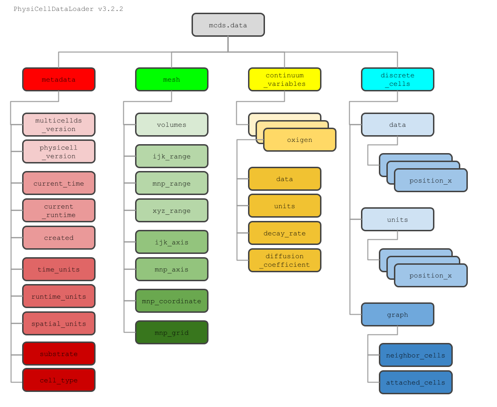

# PhysiCell Data Loader Tutorial: pcdl and python and MCDS TimeSteps

In this chapter, we will load the pcdl library and use its TimeStep class to load the data snapshot 00000012, from [data\_timeseries\_ 2d](https://github.com/elmbeech/physicelldataloader/tree/master/pcdl/output_2d) from the 2D time series test dataset.

First, please install the latest version of physicelldataloader (pcdl),
as described in the [HowTo](https://github.com/elmbeech/physicelldataloader/blob/master/man/HOWTO.md) chapter.

And, if not already done so, have a quick read through the pcdl [background](https://github.com/elmbeech/physicelldataloader/tree/master/man/TUTORIAL_introduction.md) information.


## Preparation

To runs this tutorial,
you can either work the data that is currently in your output folder,
or you can install the 2D unit test dataset into your PhysiCell output folder,
by executing the following command sequence.

&#x26A0; **Warning: if you run this sequence, all data currently in your PhysiCell/output folder will be overwritten!**

```bash
cd path/to/PhysiCell
```
```bash
make data-cleanup
python3 -c"import pathlib, pcdl, shutil; pcdl.install_data(); s_ipath=str(pathlib.Path(pcdl.__file__).parent.resolve()/'output_2d'); shutil.copytree(s_ipath, 'output', dirs_exist_ok=True)"
```


## Loading an MCDS Time Step

By default, all data related to the snapshot is loaded.
For speed and less memory usage, it is however possible to only load the essential (output xml and cell mat data),
and exclude microenvironment, graph data, PhysiBoss data, and the PhysiCell\_settings.xml cell type ID label mapping. \
For custom\_data variables it is possible to specify data types, apart from the generic float type, namely: int, bool, and str. \
For paths, in general, unix (slash) and windows (backslash) notation will work.

The basic way to load a mcds time step object:
```python
import pcdl  # load the physicell data loader library
print('pcdl version:', pcdl.__version__)  # it is easy to figure out which pcdl version you run

mcds = pcdl.TimeStep('output/output00000012.xml')  # loads the whole snapshot: the xml and all related mat and graph files
```

The fine tuned way of loading a mcds time step object:

```python
import pcdl  # load the physicell data loader library
print('pcdl version:', pcdl.__version__)  # it is easy to figure out which pcdl version you run

mcds = pcdl.TimeStep(s_pathfile, custom_data_type={}, microenv=True, graph=True, physiboss=True, settingxml='PhysiCell_settings.xml', verbose=True)
```

The verbosity for pcdl output you can tune, even after loading the data.

```python3
mcds.set_verbose_false()
```
```python3
mcds.set_verbose_true()
```


## The MCDS Data Structure

All loaded data lives in `mcds.data` dictionary.\
As in the original python-loader, we tried to keep everything organized inside this dictionary.\
Regarding the original python-loader, the structure has slightly changed.\

**In pcdl, all data is accessible by functions. There should be no need to fetch data directly from the `mcds.data` dictionary!**

Anyhow, let's take a look at what we actually have in here.



```python
# main data branches
sorted(mcds.data.keys())  # metadata, mesh, substrate microenvironment (continuum_variables), and cell agent (discrete_cells)

# metadata
sorted(mcds.data['metadata'].keys())  # multicellds version, physicell version, simulation time, runtime, time stamp, time unit, spatial unit, and substrate and cell type ID label mappings

# mesh
sorted(mcds.data['mesh'].keys())  # voxel (ijk), mesh (nmp), and position (xyz) range, axis, coordinate, grid objects, and voxel volume

# microenvironment
sorted(mcds.data['continuum_variables'].keys())  # list of all processed substrates, e.g. oxygen
sorted(mcds.data['continuum_variables']['oxygen'].keys())  # substrate related data values, unit, diffusion coefficient, and decay rate

# cell
sorted(mcds.data['discrete_cells'].keys())  # data, units, and graph dictionaries
sorted(mcds.data['discrete_cells']['data'].keys())  # all cell related, tracked data
sorted(mcds.data['discrete_cells']['units'].keys())  # all units from the cell related, tracked data
sorted(mcds.data['discrete_cells']['graph'].keys())  # neighbor_cells and attached_cells graph dictionaries
```

**Once again, loud, for the ones in the back, in pcdl >= version 3, all data is accessible by functions.
There should be no need to fetch data directly from the `mcds.data` dictionaries.**

We will explore these functions in the upcoming sections.


## Metadata Related Functions

Fetch the data's MultiCellDS version, and the PhysiCell version the data was generated.

```python
mcds.get_multicellds_version()  # will return a string like MultiCellDS_2 or MultiCellDS_0.5
```
```python
mcds.get_physicell_version()  # will return a string like PhysiCell_1.10.4 or BioFVM_1.1.7
```

Fetch simulation time, runtime, and time stamp when the data was processed.

```python
mcds.get_time()   # will return a float value like 720.0
```
```python
mcds.get_runtime()  # will return a float value like 15.596373
```
```python
mcds.get_timestamp()  # will return a sting like 2022-10-19T01:12:01Z
```

Finally, it is possible to retrieve a dictionary that lists all units from all tracked variables, from metadata, mesh, continuum\_variables, and discrete\_cells.

```python
mcds.get_unit_dict()  # will return a dictionary, which maps the variables to the units specified in the setting.xml.
```
```python
# sorted alphabetically
sorted(mcds.get_unit_dict().items())
```


## Microenvironment Data Related Functions (Continuum Variables)

In the loaded dataset, only one substrate, oxygen, was part of the simulation.\
However, let's have a look at the substrate microenvironment related functions.

We can retrieve a list of all substrates processed in the simulation,
ordered by substrate ID.

```python
mcds.get_substrate_list()  # ['oxygen']
```

We can retrieve a dictionary that maps substrate indexes to labels.

```python
mcds.get_substrate_dict()  # {'0': 'oxygen'}
```
```python
# substrates sorted alpahbetically
sorted(mcds.get_substrate_dict().values())  # ['oxygen']
```

We can also retrieve a pandas dataframe with the parameters (decay\_rate, diffusion\_coefficient) that were set for each substrate.

```python
df = mcds.get_substrate_df()
df.head()
```


### &#x2728; Microenvironment Data Analysis with [Pandas](https://pandas.pydata.org/)

Pandas mimics the [R](https://en.wikipedia.org/wiki/R_(programming_language)) computer language,
a computer language written for statistical computing.
As such, pandas provides us with the spreadsheet like DataFrame and the Series data type.

For analyzing the microenvironment statistically, a pandas dataframe
with mesh center coordinates (mnp), voxel coordinates (ijk), and all substrate concentration values can be retrieved.

```python
df_conc = mcds.get_conc_df()
df_conc.info()
```
Substrates that have in the whole domain the same concentration, carry for that time step no information.
Let's filter for substrates that have at least 2 different values over the whole domain.
```python
df_conc = mcds.get_conc_df(values=2)
df_conc.info()  # oxygen concentration varies over the domain
```

Let's filter for every substrate concentrations in voxel i == 2, j == 1, and k == 0.
```python
df_conc.loc[(df_conc.voxel_i == 2) & (df_conc.voxel_j == 1) & (df_conc.voxel_k == 0), :]
```

Please have a look at [TUTORIAL_python3_pandas.md](https://github.com/elmbeech/physicelldataloader/blob/master/man/TUTORIAL_python3_pandas.md) to learn more.


Additionally, there is a less often used function to retrieve substrate specific 3D or 2D meshgrid [numpy](https://numpy.org/) arrays.
To get a 2D meshgrids you can slice though any z stack value, the function will always pick the closest mesh center coordinate, the smaller coordinate, if you hit the saddle point between two voxels.
(This function might become deprecated in a future pcdl version.)

```python
# concentration meshgrid for a particular substrate
oxygen_2d = mcds.get_concentration('oxygen', z_slice=0)
oxygen_2d.shape  # (11, 11)
```
```python
# concentration meshgrid for a particular substrate
oxygen_3d = mcds.get_concentration('oxygen')
oxygen_3d.shape  # (11, 11, 1)
```


Additionally, there is a less often used functions to retrieve a [numpy](https://numpy.org/) array of all substrate concentrations at a particular xyz coordinate, ordered alphabetically by substrate name, like the list retrieved by the get\_substrate\_names function.
(This function might become deprecated in a future pcdl version.)

```python
# all concentration values at a particular coordinate
mcds.get_concentration_at(x=0, y=0, z=0)  # array([34.4166271])
```
```python
# all concentration values at a particular coordinate
mcds.get_concentration_at(x=111, y=22, z=-5)  # array([18.80652216])
```
```python
# all concentration values at a particular coordinate
mcds.get_concentration_at(x=111, y=22, z=-5.1)  # None and Warning @ pyMCDS.is_in_mesh : z = -5.1 out of bounds: z-range is (-5.0, 5.0)
```


### &#x2728; Microenvironment Data Analysis with [Matplotlib](https://matplotlib.org/)

For substrate concentration visualization, **matplotlib contour and contourf plots**,
for any substrate, through any z\_slice can be retrieved. \
The mcds.plot\_contour function has many parameters to fine tune the plot.
Please have a look at its docstring to learn more.

```python
fig = mcds.plot_contour('oxygen')
fig.show()
```
```python
help(mcds.plot_contour)
```

The mcds.plot\_contour function output can combine with the mcds.plot\_scatter output. \
Please have a look at [TUTORIAL_python3_matplotlib.md](https://github.com/elmbeech/physicelldataloader/blob/master/man/TUTORIAL_python3_matplotlib.md) to learn more.


### &#x2728; Microenvironment Data Analysis with [Vtk](https://vtk.org/)

For substrate concentration visualization in 3D a **rectilinear grid vtk file** can be retrieved.\
This file can be analyzed, for example with the [Paraview](https://en.wikipedia.org/wiki/ParaView) software.

```python
mcds.make_conc_vtk()
```

Please have a look at [TUTORIAL_paraview.md](https://github.com/elmbeech/physicelldataloader/blob/master/man/TUTORIAL_paraview.md) to learn more.


## Cell Data Related Functions (Discrete Cells)

In the loaded dataset, only one cell type, cancer\_cell, was part of the simulation.\
However, let's have a look at the cell agent related functions.

We can retrieve a list of all cell types processed in the simulation,
ordered by cell type ID.

```python
mcds.get_celltype_list()  # ['cancer_cell']
```

We can retrieve a dictionary that maps cell type IDs to labels.

```python
mcds.get_celltype_dict()  # {'0': 'cancer_cell'}
```


### &#x2728; Cell Data Analysis with [Pandas](https://pandas.pydata.org/)

Pandas mimics the [R](https://en.wikipedia.org/wiki/R_(programming_language)) computer language,
a computer language written for statistical computing.
As such, pandas provides us with the spreadsheet like DataFrame and the Series data type.

For analyzing the cell agent data statistically, a pandas dataframe
with the agent's position (xyz), the related mesh center coordinate (mnp), the related voxel coordinate (ijk), values from a bunch of cell attributes, the cell surrounding substrate concentrations, and some additional attributes like the voxel's cell density and the xyz vector length, and, if applicable, physiboss output, can be retrieved.

```python
df_cell = mcds.get_cell_df()
df_cell.info()
```
```
df_cell.shape  # (992, 95)  this means: 992 agents, 96 tracked variables
```

Cell attributes, that carry in all agents the same value, carry no information.
Let's filter for variables that carry at least 2 different values.

```python
df_cell = mcds.get_cell_df(values=2)
df_cell.shape # (992, 40) this means: 992 agents, 40 tracked variables
```

Let's filter for cells in voxel i2 j1 k0.

```python
df_cell.loc[(df_cell.voxel_i == 2) & (df_cell.voxel_j == 1) & (df_cell.voxel_k == 0), :]  # cells: 5, 7, 39
```

Please have a look at [TUTORIAL_python3_pandas.md](https://github.com/elmbeech/physicelldataloader/blob/master/man/TUTORIAL_python3_pandas.md) to learn more.


There exist an additional, less often used function,
to filter for cells in xyz position plus minus (voxel spacing / 2).
(This function might become deprecated in a future pcdl version.)

```python
mcds.get_cell_df_at(x=45, y=10, z=0)  # cells: 5, 7, 39
```


### &#x2728; Cell Data Analysis within the [Scverse](https://scverse.org/)

To be able to analyze cell agent data the same way as single cell RNA seq data is analyzed,
pcdl has a function to translate cell agent data into [anndata](https://anndata.readthedocs.io/en/latest/) format.
Anndata is the de facto standard for sc RNA seq data analysis in python.
Anndata is the backbone of the scverse (single cell universe) project.

```python
ann = mcds.get_anndata(values=2)
print(ann)  # AnnData object with n_obs × n_vars = 992 × 26
            #     obs: 'z_layer', 'time', 'current_phase', 'cycle_model'
            #     uns: 'neighbor'
            #     obsm: 'spatial'
            #     obsp: 'physicell_neighbor_conectivities', 'physicell_neighbor_distances'
```

variables:

```python
ann.var_names  # numerical cell attributes:  Index(['cell_BM_repulsion_strength', ... , 'total_volume'], dtype='object')
```

observation:

```python
ann.obs_names  # cell IDs: Index(['0', ..., '994'], dtype='object', name='ID', length=992)
```
```python
ann.obs_keys()  # categorical cell attributes:  ['z_layer', 'time', 'current_phase', 'cycle_model']
```
```python
ann.obsm_keys()  # cell coordinates: ['spatial']
```
```python
ann.obsm['spatial']  # the coordinate values (position\_x, position\_y) of the loaded data.
```
```python
ann.obsp  # cell neighborhood graph data.
```

unstructured data:

```python
ann.uns_keys()  # ['neighbor']
```
```python
ann.uns['neighbor']  # metadata about the neighborhood graph.
```

The output tells us that we have loaded a time step  with 992 cell agents and 26 numerical attributes (vars).
Further, we have 4 categorical cell agent attributes (obs).
We have each cell agent's xy spatial coordinate information (obsm).
And we have cell neighbor graph infromation (obsp, uns).

Please have a look at [TUTORIAL_python3_scverse.md](https://github.com/elmbeech/physicelldataloader/blob/master/man/TUTORIAL_python3_scverse.md) to learn more.


### &#x2728; Cell Data Analysis within the [Networkx](https://networkx.org/) and [Igraph](https://igraph.org/)

Fore each cell, PhysiCell tracks the cell neighborhood (if cells touch each other, if cells are attached to each other).
<!-- Moreover, to be able to generate lineage trees, PhysiCell tracks each cell's parent ID, time of birth, and time of death. -->

All this information can be represented as a graph (as in graph theory).
Pcld has a function to dump this information as [gml](https://github.com/elmbeech/physicelldataloader/blob/master/man/publication/himsolt1996gml_a_portable_graph_file_format.pdf) (graph model language) files.
This file format can be read by graph libraries, like network and igraph, for downstream analysis.

Cell neighbor touching graph
```python
mcds.make_graph_gml('touch')
```

Cell neighbor attached graph
```python
mcds.make_graph_gml('attached')
```
<!--
Cell lineage tree
```python
mcds.make_graph_gml('lineage')
```
-->

Please have a look at [TUTORIAL_python3_graph.md](https://github.com/elmbeech/physicelldataloader/blob/master/man/TUTORIAL_python3_graph.md) to learn more.


### &#x2728; Cell Data Analysis with [Matplotlib](https://matplotlib.org/)

For cell agent visualization **matplotlib scatter plots**,
for any cell attribute, through any z\_slice can be retrieved. \
The mcds.plot\_scatter function has many parameters to fine tune the plot.
Please have a look at its docstring to learn more.

```python
fig = mcds.plot_scatter()
fig.show()
```
```python
fig = mcds.plot_scatter('pressure')
fig.show()
```
```python
help(mcds.plot_scatter)
```

The mcds.plot\_contour function output can combine with the mcds.plot\_contour output. \
Please have a look at [TUTORIAL_python3_matplotlib.md](https://github.com/elmbeech/physicelldataloader/blob/master/man/TUTORIAL_python3_matplotlib.md) to learn more.


### &#x2728; Cell Data Analysis with [Vtk](https://vtk.org/)

For cell agent visualization in 3D **glyph vtk files** can be retrieved.\
This files can be analyzed, for example with the [Paraview](https://en.wikipedia.org/wiki/ParaView) software.

```python
mcds.make_cell_vtk()
```
```python
help(mcds.make_cell_vtk)
```

Please have a look at [TUTORIAL_paraview.md](https://github.com/elmbeech/physicelldataloader/blob/master/man/TUTORIAL_paraview.md) to learn more.


## Microenvironment and Cell Data Related Functions

### &#x2728; PhysiCell Data Analysis with [Napari](https://napari.org/stable/) and [Fiji Imagej](https://fiji.sc/)

For substrate and cell agent visualization, data can be saved in open microscopy's [ome.tiff](https://www.openmicroscopy.org/ome-files/) file format.

For cell agents, the default cell\_attribute outputted is the cell ID + 1, results in segmentation masks,
although, any numerical (bool, int, float) cell\_attribute can be outputted.

```python
mcds.make_ome_tiff()  # mark by cell ID + 1.
```
```python
mcds.make_ome_tiff('dead')  # mark dead and alive cells.
```

The tiff and ome.tiff files can be loaded back in to python as [numpy](https://numpy.org/) arrays.
Besides that, ome.tiff files enables us to study PhysiCell output the same way
as commonly fluorescent microscopy data is analyzed by wetlab scientists.
Please have a look at
[TUTORIAL_python3_ometiff.md](https://github.com/elmbeech/physicelldataloader/blob/master/man/TUTORIAL_python3_ometiff.md),
[TUTORIAL_python3_napari.md](https://github.com/elmbeech/physicelldataloader/blob/master/man/TUTORIAL_python3_napari.md)
and [TUTORIAL_fiji_imagej.md](https://github.com/elmbeech/physicelldataloader/blob/master/man/TUTORIAL_fijiimagej.md)
to learn more.


## Mesh Data Related Functions

For data analysis, the functions related to the mesh are most probably the least one you have to deal with.
However, these functions are very useful for tool developers. \
Let's have a look at these functions anyway!


#### Mesh and voxel spacing

It is common, but not necessary, that the voxel's width, height, and depth is the same.
In fact, in this test dataset, you will find that this is not the case.
In the related `PhysiCell_settings.xml` file, the voxel was specified as 30[nm] high, 20[nm] wide, and 10[nm] deep.

Retrieving voxel and mesh spacing from the loaded time step, you will notice that voxel and mesh spacing values differ.
This is because this data set is from a 2D simulation. For that reason, the mesh depth is set to 1.\
In 3D simulation data, voxel and mesh spacing will be the same because voxel and mesh depth is the same.

```python
mcds.get_mesh_spacing()  # [30.0, 20.0, 1]
```
```python
mcds.get_voxel_spacing() # [30.0, 20.0, 10.0]
```
```python
mcds.get_voxel_volume()  # 30[nm] * 20[nm] * 10[nm] = 6000[nm\*\*3]
```


#### Cell position, mesh center, and voxel coordinate systems

Since version 3, for clarity, coordinate labels are distinct for cell position, mesh center, and voxel index:
+ **x,y,z:** stand for cell position coordinates, and are real values.
+ **m,n,p:** stand for mesh center coordinates, and are real values.
+ **i,j,k:** stand for voxel index coordinates, and are unsigned integer values.

For a better understanding, let's fetch start and stop range values for each coordinate type.\
Unlike in the python range function, not only the start value, but also the stop value is inclusive.

```python
mcds.get_voxel_ijk_range()  # [(0, 10), (0, 10), (0, 0)]
```
```python
mcds.get_mesh_mnp_range()  # [(-15.0, 285.0), (-10.0, 190.0), (0.0, 0.0)]
```
```python
mcds.get_xyz_range()  # [(-30.0, 300.0), (-20.0, 200.0), (-5.0, 5.0)]
```

+ voxel index values stretch from 0 to 10 longitude (i), 0 to 10 latitude (j), the 2D domain is only 1 voxel deep (k).
+ mesh center values stretch from -15[nm] to 285[nm] longitude (m), -10[nm] to 190[nm] latitude (n), and the depth mesh center (p) is at zero.
+ cells can hold a positioned between -30[nm] and 300[nm] longitude (x), -20[nm] and 200[nm] latitude (y), and -5[nm] and 5[nm] depth (z).

For voxel and mesh centers, we can fetch the axis tick lists.\
Each of this function will return a list of 3 [numpy](https://numpy.org/) arrays, ordered by ijk or mnp, respective.

```python
mcds.get_voxel_ijk_axis()
```
```python
mcds.get_mesh_mnp_axis()
```


#### Coordinate system helper functions

There are three helper functions for interacting with the coordinate systems:
One to figure out if a particular xyz coordinate is still in side the mesh,
the two other ones to translate an xyz coordinate into ijk voxel or mnp mesh center indices, respective.
The translation functions will by default checks if the given coordinate is in the mesh.

Is the given xyz coordinate in the mesh?

```python
mcds.is_in_mesh(x=0, y=0, z=0)  # True
```
```python
mcds.is_in_mesh(x=111, y=22, z=-5)  # True
```
```python
mcds.is_in_mesh(x=111, y=22, z=-5.1)  # False and Warning @ pyMCDS.is_in_mesh : z = -5.1 out of bounds: z-range is (-5.0, 5.0)
```

Translate a xyz position coordinate into a ijk voxel coordinate:
```python
mcds.get_voxel_ijk(x=0, y=0, z=0)  # [0,0,0]
```
```python
mcds.get_voxel_ijk(x=111, y=22, z=-5)  # [4, 2, 0]
```
```python
mcds.get_voxel_ijk(x=111, y=22, z=-5.1)  # None and Warning @ pyMCDS.is_in_mesh : z = -5.1 out of bounds: z-range is (-5.0, 5.0)
```

Translate a xyz position coordinate into a mnp mesh center coordinate:

```python
mcds.get_mesh_mnp(x=0, y=0, z=0)  # [0,0,0]
```
```python
mcds.get_mesh_mnp(x=111, y=22, z=-5)  # [4, 2, 0]
```
```python
mcds.get_mesh_mnp(x=111, y=22, z=-5.1)  # None and Warning @ pyMCDS.is_in_mesh : z = -5.1 out of bounds: z-range is (-5.0, 5.0)
```


### The mesh

We can even retrieve all mnp mesh center coordinate triplets, and the meshgrids in 2D or 3D shape itself.

The coordinate triplets are returned as [numpy](https://numpy.org/) array.

```python
# all mnp coordinates
mnp_coordinats = mcds.get_mesh_coordinate()  # numpy array with shape (3, 121)
mnp_coordinats.shape  # (3, 121)
```

The meshgrids are returned as a 3 way tensor (2D) or 4 way tensor (3D) numpy array. \
As shown below, these tensors can be subset in the common numpy way.

2D mesh grid:

```python
mn_meshgrid = mcds.get_mesh_2D()  # numpy array with shape (2, 11, 11)
mn_meshgrid.shape # (2, 11, 11)
```
```python
m_meshgrid = mn_meshgrid[0]  # or explicit mn_meshgrid[0,:,:]
m_meshgrid.shape  # (11, 11)
```
```python
n_meshgrid = mn_meshgrid[1]  # or explicit mn_meshgrid[1,:,:]
n_meshgrid.shape  # (11, 11)
```

3D mesh grid:

```python
mnp_meshgrid = mcds.get_mesh()  # numpy array with shape (3, 11, 11, 1)
mnp_meshgrid.shape # (3, 11, 11, 1)
```
```python
m_meshgrid = mnp_meshgrid[0]  # or explicit mnp_meshgrid[0,:,:,:]
m_meshgrid.shape  # (11, 11, 1)
```
```python
n_meshgrid = mnp_meshgrid[1]  # or explicit mnp_meshgrid[1,:,:,:]
n_meshgrid.shape  # (11, 11, 1)
```
```python
p_meshgrid = mnp_meshgrid[2]  # or explicit mnp_meshgrid[2,:,:,:]
p_meshgrid.shape  # (11, 11, 1)
```


### Data Clean Up

After you are done checking out the 2D unit test dataset,
you can uninstall the datasets and remove the data in the output folder,
by executing the following command sequence.

```bash
python3 -c"import pcdl; pcdl.uninstall_data()"
make data-cleanup
```

That's it!

